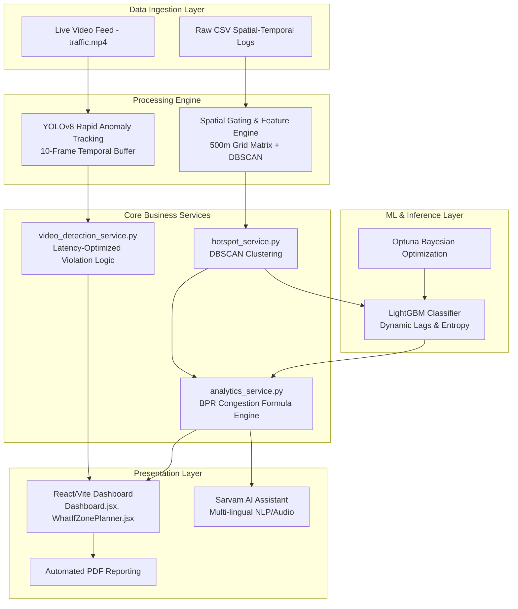

# ParkIQ – Enterprise Intelligent Transportation System (ITS)

> **GridLock Hackathon · Stage 2 · Problem Statement 1**  
> **Built for Bengaluru Traffic Police (BTP)**  
> 📊 **[Pitch Deck / Presentation (Canva)](https://canva.link/c3gvjoszc9e7s91)**

**ParkIQ** is an advanced, AI-driven Intelligent Transportation System (ITS) engineered specifically for the Bengaluru Traffic Police (BTP) to eradicate parking-induced urban gridlock. By synthesizing massive-scale spatial-temporal violation data with real-time computer vision, ParkIQ transforms historically reactive traffic policing into a highly precise, proactive, and financially accountable enforcement operation.

## 🚀 Executive Summary

Urban gridlock driven by illegal parking is a multi-million dollar economic bleed. ParkIQ solves this by unifying historical violation data, machine learning, and edge computer vision into a single command center. 
*   **Predictive Intelligence**: We forecast high-risk congestion zones before they form using an advanced spatial-temporal LightGBM model.
*   **Edge Vision**: Our 10-frame low-latency YOLOv8 pipeline actively monitors live CCTV feeds to flag stationary anomalies.
*   **Financial Accountability**: We dynamically quantify the "Congestion Cost Score" (CCS) into direct economic losses (INR/day) using scalable traffic delay formulas, allowing precincts to prioritize high-ROI enforcement.

---

## 🏗️ Core Architecture & Data Pipelines

ParkIQ operates as a high-throughput, decoupled microservices architecture designed for enterprise scalability. 



---

## 🧠 Intelligent Machine Learning Pipeline

ParkIQ relies on a highly optimized **LightGBM Classifier** to deliver state-of-the-art predictive analytics. Our pipeline prevents spatial data leakage while maximizing generalization across Bengaluru's diverse urban landscape.

1. **Spatial Framework & Feature Engineering**: 
   The platform divides the city into a strict **500m grid-cell matrix**. For every cell, the engine engineers **11 core features**. We heavily utilize advanced metrics, such as a **Moore Neighborhood spatial lag** (`lag_violation_count`) to grasp localized density, and **Shannon temporal entropy** to measure the hourly spread of violations.
2. **DBSCAN & K-Means Spatial Abstraction**: 
   GPS coordinates are abstracted using a base **DBSCAN pre-clustering layer** and unsupervised **K-Means**. This guarantees that the AI predicts actionable geographic hotspots rather than overfitting to raw coordinates.
3. **The LightGBM Classifier (`train.py`)**: 
   We chose **LightGBM** for its leaf-wise tree growth, which yields superior performance and accuracy on deep spatial splits.
4. **Rigorous Bayesian Validation**: 
   The model undergoes **Optuna** Bayesian hyperparameter optimization over 20 trials, utilizing an inner 5-fold cross-validation loop with early stopping. Finally, it passes a strict Outer 5-fold Stratified Cross-Validation test to ensure robust real-world generalization.

Trained artifacts (`hotspot_model.pkl`, `label_encoder.pkl`, `model_metrics.json`) are versioned and deployed seamlessly via our dedicated ML Inference API.

---

## 📷 Edge-Case Computer Vision Rigor

ParkIQ's real-time video analytics pipeline (`video_detection_service.py`) utilizes a highly optimized **YOLOv8** network to process live CCTV feeds.

We go far beyond naive bounding box detection:
*   **Robust State-Vector Tracking**: Every vehicle is assigned a continuous state-vector, mapping its trajectory, velocity, and spatial footprint across the visual plane.
*   **Rapid Anomaly Detection**: The system maintains a tightly tuned **10-frame temporal buffer** to detect illegal stationary vehicles with extremely low latency, ensuring immediate alerts for fresh gridlock events.

---

## ✨ Core Enterprise Features

*   **DBSCAN Spatial Clustering Engine** 
    Groups raw GPS coordinates of over 298k illegal parking events into actionable, high-density geographic hotspots, stripping away noise and outliers.
*   **Dynamic Enforcement Opportunity Cost**
    Calculates the real-time daily economic loss caused by unpatrolled high-risk zones. It features an interactive **"Simulate Manpower"** slider that allows users to instantly visualize how scaling patrol deployments impacts the economic loss and coverage gap.
*   **Interactive What-If Zone Planner** 
    An advanced sandbox UI (`WhatIfZonePlanner.jsx`) allowing city planners to draw arbitrary polygons directly on the map. By adjusting "Clearance Percentages", planners instantly simulate how clearing hotspots reduces the Congestion Cost Score (CCS) and translates to precise ₹/day ROI savings.
*   **AI Chatbot & Smart Insights (Sarvam AI)** 
    An integrated, speech-enabled AI assistant that provides verbal and textual explanations of complex metrics, summarizes zone analytics, and actively recommends patrol strategies.
*   **Interactive Hotspot Profiles & Radar Charts** 
    Dynamic, selectable map widgets that render localized zone profiles. Includes multi-axis radar charts mapping Density, Peak %, Severity, Main Road alignment, and Junction proximity instantly.
*   **Model Diagnostics & Algorithmic Transparency** 
    Structured visual dashboards (`ModelScores.jsx`) detailing model confidence, test sample verification, confusion matrices, and feature permutation importance (e.g., showing how heavily `temporal_entropy` influenced the prediction).
*   **Automated Deployment Scheduling** 
    Generates algorithmic deployment windows (e.g., 08:00-10:00) and priority queues (IMMEDIATE, HIGH) for the highest-impact clusters, optimizing existing police manpower.
*   **7-Day Violation Risk Forecast** 
    Employs historical analysis mapped against day-of-week patterns to forecast future peak violation hours and categorical risk levels.

---

## 🛠️ Setup & Installation

ParkIQ provides two ways to launch the platform: an **Automated Zero-Friction Launch (macOS/Linux/WSL)** and a **Manual Step-by-Step Launch (Windows/Cross-Platform)**.

### Prerequisites (All Platforms)
*   **Python 3.10+**
*   **Node.js 18+** (with `npm`)
*   **Git**

*(Note: Ensure the dataset `jan to may police violation_anonymized791b166.csv` is present in the root directory prior to launch).*

### 1. Configure Environment Variables (All Platforms)
Before running the application, configure your `.env` files in both the `backend` and `frontend` directories.

**Backend (`backend/.env`):**
```env
CSV_PATH=../jan to may police violation_anonymized791b166.csv
MODEL_DIR=../model/saved_models
HOST=0.0.0.0
PORT=8000
SARVAM_API_KEY=your_sarvam_api_key_here
```

**Frontend (`frontend/.env`):**
```env
VITE_MAPPLS_TOKEN=your_mappls_token_here
```

---

### Option A: Automated Zero-Friction Launch (macOS / Linux / WSL)

An automated launch script is provided to handle virtual environments, dependency installation, model training (if required), and concurrent service startup.

```bash
chmod +x run.sh
./run.sh
```

**Access Points:**
*   **Frontend Dashboard:** [http://localhost:5173](http://localhost:5173)
*   **Backend API / Swagger UI:** [http://localhost:8000/docs](http://localhost:8000/docs)

To shut down all services gracefully, simply press `Ctrl+C` in the terminal.

---

### Option B: Manual Step-by-Step Launch (Windows / Cross-Platform)

If you prefer running services manually or are on a native Windows environment without WSL, follow these steps.

#### Step 1: Train the Machine Learning Model
Before starting the server, you must preprocess the raw dataset and train the classification model.
1. Navigate to the `model/` directory:
   ```bash
   cd model
   ```
2. Install Python dependencies:
   ```bash
   pip install -r requirements.txt
   ```
3. Run the training script:
   ```bash
   cd src
   python train.py
   ```
   *Note: This script will clean the dataset, engineer spatial features, create dynamic temporal lags, and train the LightGBM classifier using Optuna.*
4. Run the evaluation script (optional):
   ```bash
   python evaluate.py
   ```

#### Step 2: Start the Backend Server
The backend acts as the data engine for the dashboard.
1. Navigate to the `backend/` directory:
   ```bash
   cd ../backend
   ```
2. Install python dependencies:
   ```bash
   pip install -r requirements.txt
   ```
3. Start the FastAPI application:
   ```bash
   python -m app.main
   ```

#### Step 3: Start the Model API Service (Optional)
The backend is fully capable of running predictions by importing files directly from the model package. However, if you prefer running predictions via a standalone microservice:
1. Navigate to the `model/api/` directory:
   ```bash
   cd ../model/api
   ```
2. Run the server:
   ```bash
   python model_api.py
   ```

#### Step 4: Start the Frontend App
1. Navigate to the `frontend/` directory:
   ```bash
   cd ../frontend
   ```
2. Install NPM packages:
   ```bash
   npm install
   ```
3. Start the Vite development server:
   ```bash
   npm run dev
   ```
4. Open your web browser and navigate to **[http://localhost:5173](http://localhost:5173)**.

---

## 📁 Directory Structure

```text
├── backend/                  # Python FastAPI application server
│   ├── app/
│   │   ├── routes/           # REST API routing controllers
│   │   ├── services/         # Core business logic and clustering algorithms
│   │   └── schemas/          # Data validation and serialization models
│   ├── requirements.txt      # Backend package dependencies
│   └── .env                  # Environment configuration
├── frontend/                 # React SPA (Single Page Application)
│   ├── src/
│   │   ├── api/              # Axios HTTP client configuration
│   │   ├── pages/            # High-level route views and dashboard containers
│   │   └── components/       # Reusable user interface components
│   ├── package.json          # Node ecosystem configuration
│   └── .env                  # Client-side environment variables
├── model/                    # Machine Learning and Data Science pipeline
│   ├── api/                  # Standalone inference microservice
│   ├── src/                  # Feature engineering, training, and evaluation scripts
│   ├── saved_models/         # Serialized model artifacts and metric outputs
│   └── requirements.txt      # Data science package dependencies
├── docs/                     # Technical documentation and architecture specs
├── docker-compose.yml        # Multi-container orchestration configuration
└── LICENSE                   # Open-source license declaration
```

---

## 👥 Team BharatBytes

Built for **Flipkart GridLock Hackathon Stage 2**
