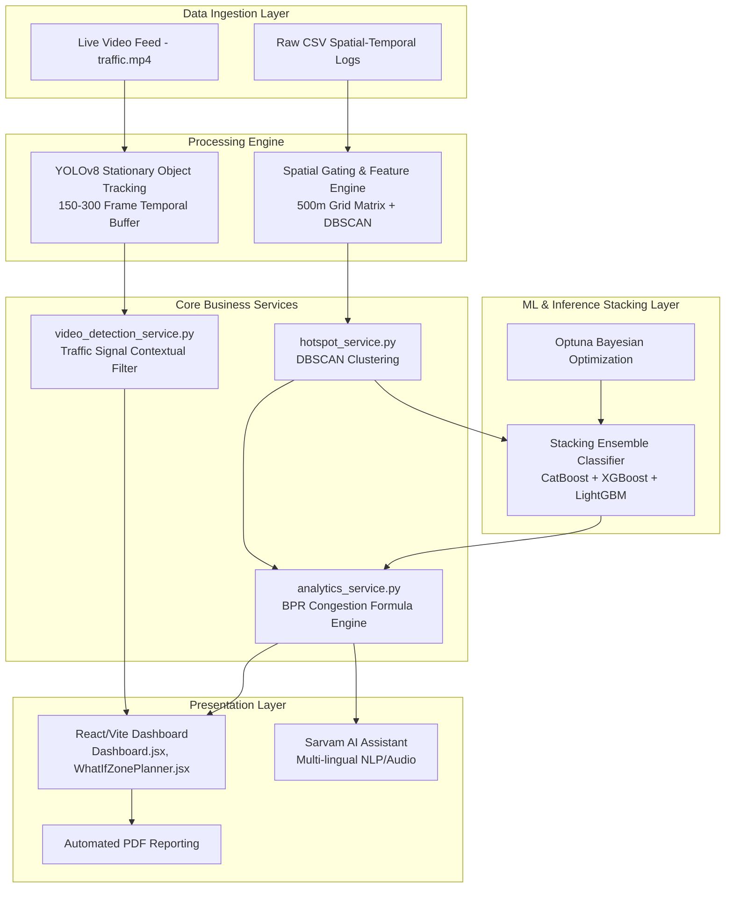

# ParkIQ – Enterprise Intelligent Transportation System (ITS)

> **GridLock Hackathon · Stage 2 · Problem Statement 1**  
> **Built for Bengaluru Traffic Police (BTP)**  
> 📊 **[Pitch Deck / Presentation (Canva)](https://canva.link/c3gvjoszc9e7s91)**

ParkIQ is an enterprise-grade, venture-ready Intelligent Transportation System (ITS) designed to autonomously detect, quantify, and mitigate parking-induced congestion. Engineered for the Bengaluru Traffic Police (BTP), ParkIQ processes over 298,450 spatial-temporal violation records and integrates real-time CCTV edge analytics to transform reactive patrols into dynamic, data-driven enforcement operations.

---

## 🏗️ Core Architecture & Data Pipelines

ParkIQ operates as a high-throughput, decoupled microservices architecture. 



---

## 🧮 Mathematical & ML Framework

### Defensible Traffic Modeling: The BPR Congestion Function
Unlike empirical or arbitrary traffic heuristics, ParkIQ quantifies the **Congestion Cost Score (CCS)** using a modified formulation of the Bureau of Public Roads (BPR) congestion function:

$$T = T_0 \left[1 + \alpha \left(\frac{V}{C}\right)^\beta\right]$$

**Where:**
*   $T$: Predicted travel time under congested conditions.
*   $T_0$: Free-flow travel time.
*   $V$: Real-time traffic volume.
*   $C$: Effective lane capacity.
*   $\alpha, \beta$: Empirically calibrated impedance parameters.

**The Economic Impact Engine:**
When illegal parking occurs, it effectively reduces the functional lane width ($W_p$). This geometric constraint dynamically drops the maximum capacity ($C_0 \to C_{restricted}$), causing an immediate escalation in the volume-to-capacity ratio ($V/C$). ParkIQ calculates this resulting delay ($\Delta T$) and converts it into direct economic loss (Enforcement Opportunity Cost) by modeling the Value of Time (VoT) and excess fuel burn across a distributed vehicle-type matrix (HGV, LGV, Two-Wheelers).

### Spatial ML Pipeline & Stacking Ensemble (Detailed Architecture)
ParkIQ does not rely on basic algorithms like Random Forests. Our core intelligence layer is powered by a rigorously optimized **StackingClassifier**. The pipeline is built to prevent spatial data leakage and ensure maximum generalization across Bengaluru's diverse urban grid.

1.  **Spatial Framework & Feature Engineering (`feature_engineering.py`)**: 
    We implement a rigid **500m grid-cell matrix** (approx. $0.0025^\circ$ coordinates). The engine extracts 12 distinct features per cell. Crucially, we incorporate **Moore Neighborhood spatial lag features** (`lag_violation_count`, `lag_ccs`) to understand localized density contexts, and compute **Shannon temporal entropy** to measure how spread out violations are across hours. Interaction features like `traffic_density_index` and `peak_severity_risk` are also synthesized.
2.  **DBSCAN & K-Means Reconciliation**: 
    The grid framework is strictly reconciled with our base **DBSCAN pre-clustering layer** and an unsupervised **K-Means** spatial abstraction layer. This ensures that the AI predictions correspond accurately to actionable geographic hotspots without memorizing raw GPS coordinates.
3.  **The Stacking Ensemble (`train.py`)**: 
    The base layer comprises three powerful gradient boosting frameworks:
    *   **CatBoost** (handles complex categorical interactions)
    *   **XGBoost** (optimized for deep tree spatial splits)
    *   **LightGBM** (leaf-wise growth for performance)
    The meta-learner is a **Logistic Regression** model, ensuring smooth probability calibration across the outputs.
4.  **Rigorous Optimization & Validation**: 
    The ensemble is heavily tuned via **Optuna** Bayesian optimization over 30 trials using a rigid 3-fold inner cross-validation. The final selected model undergoes 5-fold Stratified Cross-Validation. Targets are dynamically binned into LOW, MODERATE, HIGH, and CRITICAL categories using quantile cuts (`pd.qcut`) to prevent class imbalance.

Trained model artifacts are strictly versioned (e.g., `hotspot_model.pkl`, `scaler.pkl`, `label_encoder.pkl`) and deployed via our dedicated ML Inference API.

---

## 📷 Edge-Case Computer Vision Rigor

ParkIQ's real-time video analytics pipeline (`video_detection_service.py`) utilizes a highly optimized **YOLOv8** network to process live CCTV feeds.

We go far beyond naive bounding box detection:
*   **Robust State-Vector Tracking**: Every vehicle is assigned a continuous state-vector, mapping its trajectory, velocity, and spatial footprint across the visual plane.
*   **Long-Term Temporal Buffers (150–300 Frames)**: To eliminate false positives, the system maintains deep temporal memory. A vehicle must remain strictly stationary across long temporal horizons (adjusted for FPS) to trigger an anomaly.
*   **Traffic Signal Contextual Filter**: This proprietary logic layer isolates authentic parking anomalies from standard urban gridlock. By analyzing the collective motion vectors of surrounding vehicles, the system understands when a car is stopped at a red light (gridlock) versus when it is illegally parked obstructing a flowing lane.

---

## ✨ Enterprise Features (In-Depth)

*   **DBSCAN Spatial Clustering Engine** 
    Groups raw GPS coordinates of over 298k illegal parking events into actionable, high-density geographic hotspots, stripping away noise and outliers.
*   **Dynamic Enforcement Opportunity Cost (Financial Dashboard)**
    Instead of just displaying "traffic delays", this engine calculates the real-time daily economic loss caused by unpatrolled high-risk zones. It models excess fuel burn and wasted man-hours, presented in a premium glassmorphic UI with glowing pulse animations and dynamic shimmering progress bars to drive immediate police action.
*   **Interactive What-If Zone Planner** 
    An advanced sandbox UI (`WhatIfZonePlanner.jsx`) allowing city planners to draw polygons on the map and simulate traffic improvements. Planners can adjust "Clearance Percentages" to instantly see how clearing *X%* of a hotspot translates to specific ₹/day ROI and Congestion Cost Score (CCS) reductions.
*   **AI Chatbot & Smart Insights (Powered by Sarvam AI)** 
    Features an integrated speech-enabled AI assistant. It provides verbal and textual explanations of complex metrics, summarizes zone analytics, and actively recommends patrol strategies, breaking down technical barriers for ground-level officers.
*   **City-Wide CCS Distribution Analytics** 
    Analyzes all identified zones directly via the backend API to provide a comprehensive, unbiased view of congestion severity (LOW to CRITICAL) proportional to the entire city layout.
*   **Interactive Hotspot Profiles & Radar Charts** 
    Dynamic, selectable widgets that render localized zone profiles. Includes multi-axis radar charts mapping Density, Peak %, Severity, Main Road alignment, and Junction proximity instantly on demand.
*   **Model Diagnostics & Algorithmic Transparency UI** 
    Structured visual sections detailing model confidence, test sample verification, confusion matrices, and feature permutation importance (e.g., showing how heavily `temporal_entropy` influenced the prediction).
*   **Automated Deployment Scheduling** 
    Generates algorithmic deployment windows (e.g., 08:00-10:00) and priority queues (IMMEDIATE, HIGH) for the highest-impact clusters, optimizing existing police manpower.
*   **7-Day Violation Risk Forecast** 
    Employs pattern-based historical analysis mapped against day-of-week trends to forecast future peak violation hours and categorical risk levels up to a week in advance.

---

## 🛠️ Setup & Installation

Follow these steps to set up and run the entire ParkIQ stack locally.

### Prerequisites

Ensure you have the following installed on your machine:
*   **Python 3.10 or higher**
*   **Node.js 18 or higher** (including `npm`)
*   **Git**

---

### Step 1: Data Verification

ParkIQ processes a large dataset containing anonymized violation logs.
1. Locate the file `jan to may police violation_anonymized791b166.csv` in the root directory.
2. If it is still zipped, extract `jan to may police violation_anonymized791b166.csv.zip` into the root directory.

---

### Step 2: Configure Environment Variables

Both the backend and frontend rely on environment variables to access API endpoints and services.

#### Backend Configuration
Navigate to the `backend/` directory and check/create a `.env` file:
```bash
cd backend
```
Create a `.env` file containing:
```env
# Path to the primary raw dataset (relative or absolute)
CSV_PATH=../jan to may police violation_anonymized791b166.csv

# Path to the folder where trained models are saved
MODEL_DIR=../model/saved_models

# Server network settings
HOST=0.0.0.0
PORT=8000

# AI APIs (used for voice assistance and insights generation)
SARVAM_API_KEY=your_sarvam_api_key_here
```

#### Frontend Configuration
Navigate to the `frontend/` directory and check/create a `.env` file:
```bash
cd ../frontend
```
Create a `.env` file containing:
```env
# Mappls (MapmyIndia) Map SDK Token
VITE_MAPPLS_TOKEN=your_mappls_token_here
```

---

### Step 3: Train the Machine Learning Model

Before starting the server, you must preprocess the raw dataset and train the classification model.

1. Navigate to the `model/` directory:
   ```bash
   cd ../model
   ```
2. Install Python dependencies:
   ```bash
   pip install -r requirements.txt
   ```
3. Run the training script:
   ```bash
   cd src
   python train.py
   ```
   *Note: This script will clean the dataset, engineer spatial features based on 500m grid cells, apply SMOTE class balancing, and train the Stacking Ensemble classifier.*
4. Run the evaluation script (optional):
   ```bash
   python evaluate.py
   ```
   *This saves performance plots (confusion matrix, feature importance, ROC curves) inside `model/saved_models/`.*

---

### Step 4: Start the Backend Server

The backend acts as the data engine for the dashboard.

1. Navigate to the `backend/` directory:
   ```bash
   cd ../../backend
   ```
2. Install python dependencies:
   ```bash
   pip install -r requirements.txt
   ```
3. Start the FastAPI application:
   ```bash
   python -m app.main
   ```
   *The API documentation will be available at [http://localhost:8000/docs](http://localhost:8000/docs).*

---

### Step 5: Start the Model API Service (Optional)

The backend is fully capable of running predictions by importing files directly from the model package. However, if you prefer running predictions via a standalone microservice:

1. Navigate to the `model/api/` directory:
   ```bash
   cd ../model/api
   ```
2. Run the server:
   ```bash
   python model_api.py
   ```
   *The model service will start on [http://localhost:8001](http://localhost:8001).*

---

### Step 6: Start the Frontend App

1. Navigate to the `frontend/` directory:
   ```bash
   cd ../../frontend
   ```
2. Install NPM packages:
   ```bash
   npm install
   ```
3. Start the Vite development server:
   ```bash
   npm run dev
   ```
4. Open your web browser and navigate to **[http://localhost:5173](http://localhost:5173)**.

---

## 📁 Directory Structure

```
├── backend/                  # FastAPI Backend API Server
│   ├── app/
│   │   ├── routes/           # REST endpoints (hotspots, predictions, analytics, assistant)
│   │   ├── services/         # DBSCAN, calculations, and AI service logic
│   │   └── schemas/          # Pydantic schemas for requests/responses
│   ├── requirements.txt      # Backend Python dependencies
│   └── .env                  # Backend credentials & file paths
├── frontend/                 # React + Vite Client Dashboard
│   ├── src/
│   │   ├── api/              # Axios interface to REST API
│   │   ├── pages/            # View components (Dashboard, Hotspots, Diagnostics, WhatIfZonePlanner)
│   │   └── components/       # Common visual elements (Sidebar, Charts, AI Assistant)
│   ├── package.json          # Node dependencies and build scripts
│   └── .env                  # Map Token
├── model/                    # Python ML Training Pipeline & Model API
│   ├── api/                  # Standalone FastAPI model prediction service
│   ├── src/                  # Code for training, evaluation, and inference
│   ├── saved_models/         # Serialized classifiers (hotspot_model.pkl), scalers, and metric files
│   └── requirements.txt      # ML dependencies (sklearn, imblearn, pandas, optuna)
├── docs/                     # Platform architecture and dataset specs
├── docker-compose.yml        # Multi-container local orchestration script
└── LICENSE                   # Project license file
```

---

## 👥 Team BharatBytes

Built for **Flipkart GridLock Hackathon Stage 2**
