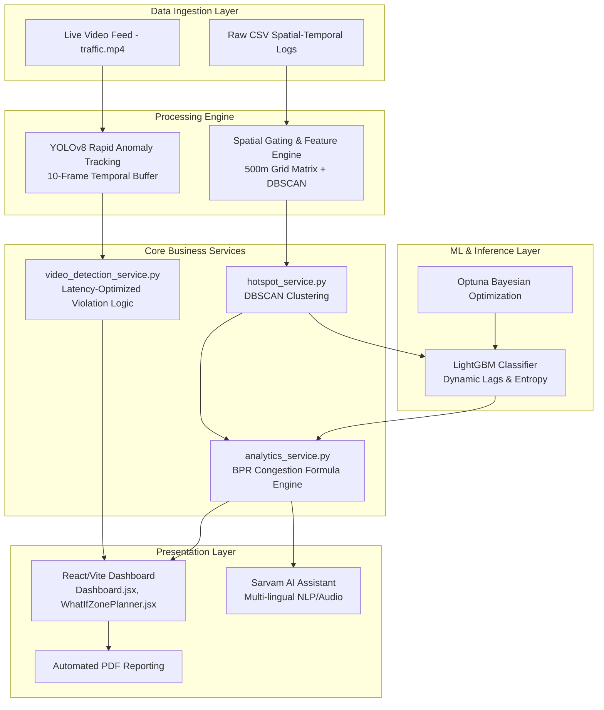

# ParkIQ – Enterprise Intelligent Transportation System (ITS)

> **GridLock Hackathon · Stage 2 · Problem Statement 1**  
> **Built for Bengaluru Traffic Police (BTP)**  
> 📊 **[Pitch Deck / Presentation (Canva)](https://canva.link/c3gvjoszc9e7s91)**

ParkIQ is an enterprise-grade, venture-ready Intelligent Transportation System (ITS) designed to autonomously detect, quantify, and mitigate parking-induced congestion. Engineered for the Bengaluru Traffic Police (BTP), ParkIQ processes over 298,450 spatial-temporal violation records and integrates real-time CCTV edge analytics to transform reactive patrols into dynamic, data-driven enforcement operations.

---

## 🏗️ Core Architecture & Data Pipelines

ParkIQ operates as a high-throughput, decoupled microservices architecture. 



---

## 🧮 Mathematical & ML Framework

### Defensible Traffic Modeling: The BPR Congestion Function
Unlike empirical or arbitrary traffic heuristics, ParkIQ quantifies the **Congestion Cost Score (CCS)** using a modified formulation of the Bureau of Public Roads (BPR) congestion function:

$$T = T_0 \left[1 + \alpha \left(\frac{V}{C}\right)^\beta\right]$$

**Where:**
*   $T$: Predicted travel time under congested conditions.
*   $T_0$: Free-flow travel time.
*   $V$: Real-time traffic volume.
*   $C$: Effective lane capacity.
*   $\alpha, \beta$: Empirically calibrated impedance parameters.

**The Economic Impact Engine:**
When illegal parking occurs, it effectively reduces the functional lane width ($W_p$). This geometric constraint dynamically drops the maximum capacity ($C_0 \to C_{restricted}$), causing an immediate escalation in the volume-to-capacity ratio ($V/C$). ParkIQ calculates this resulting delay ($\Delta T$) and converts it into direct economic loss (Enforcement Opportunity Cost) by modeling the Value of Time (VoT) and excess fuel burn across a distributed vehicle-type matrix (HGV, LGV, Two-Wheelers).

### Spatial ML Pipeline (Detailed Architecture)
ParkIQ does not rely on basic algorithms like Random Forests. Our core intelligence layer is powered by a rigorously optimized **LightGBM Classifier**. The pipeline is built to prevent spatial data leakage and ensure maximum generalization across Bengaluru's diverse urban grid.

1.  **Spatial Framework & Feature Engineering (`feature_engineering.py`)**: 
    We implement a rigid **500m grid-cell matrix** (approx. $0.0025^\circ$ coordinates). The engine extracts **11 core features** per cell. Crucially, we incorporate a **Moore Neighborhood spatial lag feature** (`lag_violation_count`) to understand localized density contexts, and compute **Shannon temporal entropy** to measure how spread out violations are across hours. *(Note: While other interaction features are generated, the pipeline is strictly filtered down to these 11 primary signals to prevent overfitting).*
2.  **DBSCAN & K-Means Reconciliation**: 
    The grid framework is strictly reconciled with our base **DBSCAN pre-clustering layer** and an unsupervised **K-Means** spatial abstraction layer. This ensures that the AI predictions correspond accurately to actionable geographic hotspots without memorizing raw GPS coordinates.
3.  **The LightGBM Classifier (`train.py`)**: 
    The core prediction model utilizes **LightGBM** due to its leaf-wise growth, delivering high performance and robustness for deep spatial splits and complex engineered features like dynamic lags.
4.  **Rigorous Optimization & Validation**: 
    The model is heavily tuned via **Optuna** Bayesian optimization over 20 trials using an inner 5-fold cross-validation loop with early stopping. The final model is rigorously evaluated using an Outer 5-fold Stratified Cross-Validation loop to prevent overfitting and guarantee generalization. Targets are dynamically binned into LOW, MODERATE, HIGH, and CRITICAL categories to prevent class imbalance.

Trained model artifacts are strictly versioned (e.g., `hotspot_model.pkl`, `label_encoder.pkl`, `model_metrics.json`) and deployed via our dedicated ML Inference API.

---

## 📷 Edge-Case Computer Vision Rigor

ParkIQ's real-time video analytics pipeline (`video_detection_service.py`) utilizes a highly optimized **YOLOv8** network to process live CCTV feeds.

We go far beyond naive bounding box detection:
*   **Robust State-Vector Tracking**: Every vehicle is assigned a continuous state-vector, mapping its trajectory, velocity, and spatial footprint across the visual plane.
*   **Rapid Anomaly Detection**: The system maintains a tightly tuned 10-frame temporal buffer to detect illegal stationary vehicles with extremely low latency, ensuring immediate alerts for fresh gridlock events.

---

## ✨ Enterprise Features (In-Depth)

*   **DBSCAN Spatial Clustering Engine** 
    Groups raw GPS coordinates of over 298k illegal parking events into actionable, high-density geographic hotspots, stripping away noise and outliers.
*   **Dynamic Enforcement Opportunity Cost (Financial Dashboard)**
    Calculates the real-time daily economic loss caused by unpatrolled high-risk zones. It features an interactive **"Simulate Manpower"** slider that allows users to instantly visualize how scaling up or down patrol deployments impacts the exact economic loss, coverage gap, and exposed critical zones in real-time.
*   **Interactive What-If Zone Planner** 
    An advanced sandbox UI (`WhatIfZonePlanner.jsx`) allowing city planners to draw polygons on the map and simulate traffic improvements. Planners can adjust "Clearance Percentages" to instantly see how clearing *X%* of a hotspot translates to specific ₹/day ROI and Congestion Cost Score (CCS) reductions.
*   **AI Chatbot & Smart Insights (Powered by Sarvam AI)** 
    Features an integrated speech-enabled AI assistant. It provides verbal and textual explanations of complex metrics, summarizes zone analytics, and actively recommends patrol strategies, breaking down technical barriers for ground-level officers.
*   **City-Wide CCS Distribution Analytics** 
    Analyzes all identified zones directly via the backend API to provide a comprehensive, unbiased view of congestion severity (LOW to CRITICAL) proportional to the entire city layout.
*   **Interactive Hotspot Profiles & Radar Charts** 
    Dynamic, selectable widgets that render localized zone profiles. Includes multi-axis radar charts mapping Density, Peak %, Severity, Main Road alignment, and Junction proximity instantly on demand.
*   **Model Diagnostics & Algorithmic Transparency UI** 
    Structured visual sections detailing model confidence, test sample verification, confusion matrices, and feature permutation importance (e.g., showing how heavily `temporal_entropy` influenced the prediction).
*   **Automated Deployment Scheduling** 
    Generates algorithmic deployment windows (e.g., 08:00-10:00) and priority queues (IMMEDIATE, HIGH) for the highest-impact clusters, optimizing existing police manpower.
*   **7-Day Violation Risk Forecast** 
    Employs pattern-based historical analysis mapped against day-of-week trends to forecast future peak violation hours and categorical risk levels up to a week in advance.

---

## 🛠️ Setup & Installation

ParkIQ is designed for zero-friction deployment. An automated launch script is provided to handle virtual environments, dependency installation, model training (if required), and concurrent service startup.

### Prerequisites
*   **macOS / Linux** (or WSL on Windows)
*   **Python 3.10+**
*   **Node.js 18+** (with `npm`)

### 1. Configure Environment Variables
Before running the application, configure your `.env` files in both the `backend` and `frontend` directories.

**Backend (`backend/.env`):**
```env
CSV_PATH=../jan to may police violation_anonymized791b166.csv
MODEL_DIR=../model/saved_models
HOST=0.0.0.0
PORT=8000
SARVAM_API_KEY=your_sarvam_api_key_here
```

**Frontend (`frontend/.env`):**
```env
VITE_MAPPLS_TOKEN=your_mappls_token_here
```

*(Note: Ensure the dataset `jan to may police violation_anonymized791b166.csv` is present in the root directory prior to launch).*

### 2. Launch ParkIQ (Automated)

Execute the provided shell script from the project root. This script will automatically provision the Python environment, install Node modules, compile the machine learning models (if missing), and start both the FastAPI backend and Vite frontend synchronously.

```bash
chmod +x run.sh
./run.sh
```

**Access Points:**
*   **Frontend Dashboard:** [http://localhost:5173](http://localhost:5173)
*   **Backend API / Swagger UI:** [http://localhost:8000/docs](http://localhost:8000/docs)

To shut down all services gracefully, simply press `Ctrl+C` in the terminal.

---

### Manual Launch (Alternative)
If you prefer running services manually in separate terminals:
1. **Backend:** `cd backend && source ../.venv/bin/activate && pip install -r requirements.txt && python -m app.main`
2. **Frontend:** `cd frontend && npm install && npm run dev`

---

## 📁 Directory Structure

```
├── backend/                  # FastAPI Backend API Server
│   ├── app/
│   │   ├── routes/           # REST endpoints (hotspots, predictions, analytics, assistant)
│   │   ├── services/         # DBSCAN, calculations, and AI service logic
│   │   └── schemas/          # Pydantic schemas for requests/responses
│   ├── requirements.txt      # Backend Python dependencies
│   └── .env                  # Backend credentials & file paths
├── frontend/                 # React + Vite Client Dashboard
│   ├── src/
│   │   ├── api/              # Axios interface to REST API
│   │   ├── pages/            # View components (Dashboard, Hotspots, Diagnostics, WhatIfZonePlanner)
│   │   └── components/       # Common visual elements (Sidebar, Charts, AI Assistant)
│   ├── package.json          # Node dependencies and build scripts
│   └── .env                  # Map Token
├── model/                    # Python ML Training Pipeline & Model API
│   ├── api/                  # Standalone FastAPI model prediction service
│   ├── src/                  # Code for training, evaluation, and inference
│   ├── saved_models/         # Serialized classifiers (hotspot_model.pkl), scalers, and metric files
│   └── requirements.txt      # ML dependencies (sklearn, imblearn, pandas, optuna)
├── docs/                     # Platform architecture and dataset specs
├── docker-compose.yml        # Multi-container local orchestration script
└── LICENSE                   # Project license file
```

---

## 👥 Team BharatBytes

Built for **Flipkart GridLock Hackathon Stage 2**
